# Process flow

A map of proccie's runtime, organized by `src/` module and (within `runner/`) by
file — one small section each. Every node is a `file::function` and edge labels
carry the transitions. Sections are self-contained: there are no arrows between
them; where flow crosses a boundary, a circular **`See <section>`** connector
points to where it continues. For the prose walkthrough, see
[IMPLEMENTATION.md](IMPLEMENTATION.md).

```mermaid
flowchart TB
    %% ========== main ==========
    subgraph s_main["main.rs — startup & drive"]
        direction TB
        m_run(["main → run"]) --> m_seecfg(("See config"))
        m_run --> m_filt["runnable_config"]
        m_filt --> m_build["build_logger"]
        m_build --> m_seelog(("See logger"))
        m_build --> m_seesvc(("See service"))
        m_build --> m_seethm(("See theme"))
        m_build --> m_drive{"TTY and not --no-tui?"}
        m_drive -->|yes| m_seetui(("See tui"))
        m_drive -->|no| m_plain["supervise"]
        m_plain --> m_seerun(("See run loop"))
        m_run -. installs .-> m_sig["spawn_signal_handler"]
        m_sig -. on signal .-> m_seesd(("See shutdown"))
    end

    %% ========== config ==========
    subgraph s_config["config/ — load & validate"]
        direction TB
        c_load["mod.rs::Config::load"] --> c_parse["procfile.rs · schema/ · validate.rs"]
        c_parse --> c_graph["graph.rs::adjacency — cycle check"]
        c_graph --> c_env["environment.rs::resolve"]
    end

    %% ========== service ==========
    subgraph s_service["service/ — per-service object"]
        direction TB
        sv_build["mod.rs::Service::build_all"] --> sv_status["status.rs::ServiceStatus<br/>set_status · finish_if_active · stop_if_active"]
    end

    %% ========== theme ==========
    subgraph s_theme["theme/ — colors"]
        direction TB
        th_detect["detect.rs::detect background"] --> th_pal["palette.rs · parse.rs::color"]
    end

    %% ========== logger ==========
    subgraph s_logger["logger/ — output"]
        direction TB
        lg_writer["writer.rs::TaggedWriter"] --> lg_out{"writer.rs::Output"}
        lg_out -->|no TUI| lg_stream["ANSI stream"]
        lg_out -->|TUI| lg_store["store.rs::LogStore"]
    end

    %% ========== runner/mod.rs ==========
    subgraph s_runloop["runner/mod.rs — run loop"]
        direction TB
        rl_run(["Runner::new → run"]) --> rl_spawn["spawn_process"]
        rl_spawn ==>|per process| rl_life(("See lifecycle"))
        rl_spawn --> rl_sel{"select!"}
        rl_sel -->|task finished| rl_reap["reap_joined"]
        rl_sel -->|restart_notify| rl_claim["control.rs::take_ready_restarts"]
        rl_claim --> rl_spawn
        rl_reap --> rl_idle{"control.rs::end_run_if_idle"}
        rl_idle -->|no| rl_sel
        rl_idle -->|yes| rl_ret(["exit code"])
    end

    %% ========== runner/lifecycle.rs ==========
    subgraph s_life["runner/lifecycle.rs — process execution"]
        direction TB
        lf_proc(["run_process"]) --> lf_gate{"await dependencies"}
        lf_gate -. wait_for_deps .-> lf_seedeps(("See deps"))
        lf_gate -->|dep failed / self stopped| lf_abandon["abandon"]
        lf_gate -->|all ready| lf_launch["run_attempts → run_once → spawn_child · register_group"]
        lf_launch --> lf_running["run_once — child running"]
        lf_launch -. bare — release_dependents .-> lf_seedeps2(("See deps"))
        lf_launch -. readiness .-> lf_seerdy(("See readiness"))
        lf_running -. stdout and stderr .-> lf_seepump(("See pump"))
        lf_running -->|child exits| lf_sweep["deregister_group · sweep_group"]
        lf_sweep -. drain .-> lf_seepump2(("See pump"))
        lf_sweep --> lf_seeexit(("See exit"))
        lf_retry(("See exit")) -->|retry| lf_delay["delay_retry"]
        lf_delay --> lf_launch
        lf_abandon --> lf_taskend(["task returns"])
        lf_taskend --> lf_seerun(("See run loop"))
    end

    %% ========== runner/deps.rs ==========
    subgraph s_deps["runner/deps.rs — dependency gates"]
        direction TB
        dp_wait["wait_for_deps · wait_for_own_stop"] --> dp_state{"DepState: Pending → Ready / Failed / Stopped"}
        dp_signal["signal_dep_result"] --> dp_state
    end

    %% ========== runner/readiness.rs ==========
    subgraph s_ready["runner/readiness.rs + probe.rs — readiness"]
        direction TB
        rd_poll(["spawn_readiness_poller → poll_readiness"]) --> rd_probe{"probe — shell · http · output · delay"}
        rd_probe -->|passes| rd_rel["release_if_live"]
        rd_rel --> rd_seedeps(("See deps"))
        rd_probe -->|timeout| rd_to["on_readiness_deadline"]
        rd_to --> rd_seesd(("See shutdown"))
    end

    %% ========== runner/pump.rs ==========
    subgraph s_pump["runner/pump.rs — output pump"]
        direction TB
        pm_pump(["pump · drain_output — OutputScanner"]) --> pm_seelog(("See logger"))
        pm_pump -. output-watch match .-> pm_seerdy(("See readiness"))
    end

    %% ========== runner/exit.rs ==========
    subgraph s_exit["runner/exit.rs — exit classification"]
        direction TB
        ex_cls{"settle_expected → classify_exit"}
        ex_cls -->|shutdown / manual stop| ex_stop["→ Stopped"]
        ex_cls -->|expected code| ex_done["settle_expected — release dependents"]
        ex_cls -->|unexpected, attempts remain| ex_seelife(("See lifecycle"))
        ex_cls -->|exhausted — failure| ex_fail["fail_terminally"]
        ex_cls -->|exhausted — clean| ex_endc["complete_terminally"]
        ex_stop --> ex_seesvc(("See service"))
        ex_fail --> ex_seesd(("See shutdown"))
        ex_endc --> ex_seesd
    end

    %% ========== runner/control.rs + shutdown.rs ==========
    subgraph s_shut["runner/control.rs + shutdown.rs — stop · restart · shutdown"]
        direction TB
        sd_entry(("See tui · main")) --> sd_restart["control.rs::restart_service → stop_subtree → queue_restart"]
        sd_entry --> sd_stop["control.rs::stop_service → stop_subtree"]
        sd_entry --> sd_shut["shutdown.rs::shutdown"]
        sd_entry --> sd_force["shutdown.rs::force_shutdown"]
        sd_restart --> sd_esc["shutdown.rs::signal_group · schedule_sigkill · after_grace · reap_strays"]
        sd_stop --> sd_esc
        sd_shut --> sd_esc
        sd_force --> sd_esc
        sd_restart -. restart_notify .-> sd_seerun(("See run loop"))
        sd_shut -. token cancels .-> sd_seedeps(("See deps"))
        sd_esc -. SIGTERM/SIGKILL .-> sd_seelife(("See lifecycle"))
    end

    %% ========== tui ==========
    subgraph s_tui["tui/ — terminal UI"]
        direction TB
        t_run(["mod.rs::run — event loop"]) --> t_keys["app/input.rs::handle_key"]
        t_run --> t_render["view/ — tabs · viewport · footer · search"]
        t_render --> t_seelog(("See logger"))
        t_keys --> t_kact{"key"}
        t_kact -->|r / s / c / q / Ctrl+C| t_seesd(("See shutdown"))
        t_kact -->|q or Ctrl+C again| t_escg["app/input.rs::escalate_global_stop"]
        t_escg --> t_seesd
    end

    %% ===== layout only: invisible links stack the sections vertically =====
    s_main ~~~ s_config
    s_config ~~~ s_service
    s_service ~~~ s_theme
    s_theme ~~~ s_logger
    s_logger ~~~ s_runloop
    s_runloop ~~~ s_life
    s_life ~~~ s_deps
    s_deps ~~~ s_ready
    s_ready ~~~ s_pump
    s_pump ~~~ s_exit
    s_exit ~~~ s_shut
    s_shut ~~~ s_tui
```

